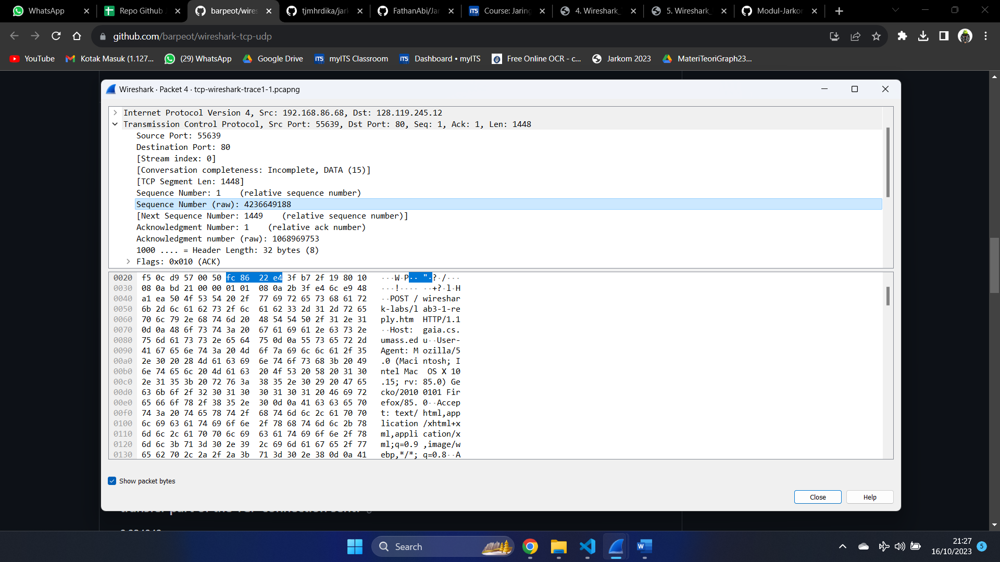
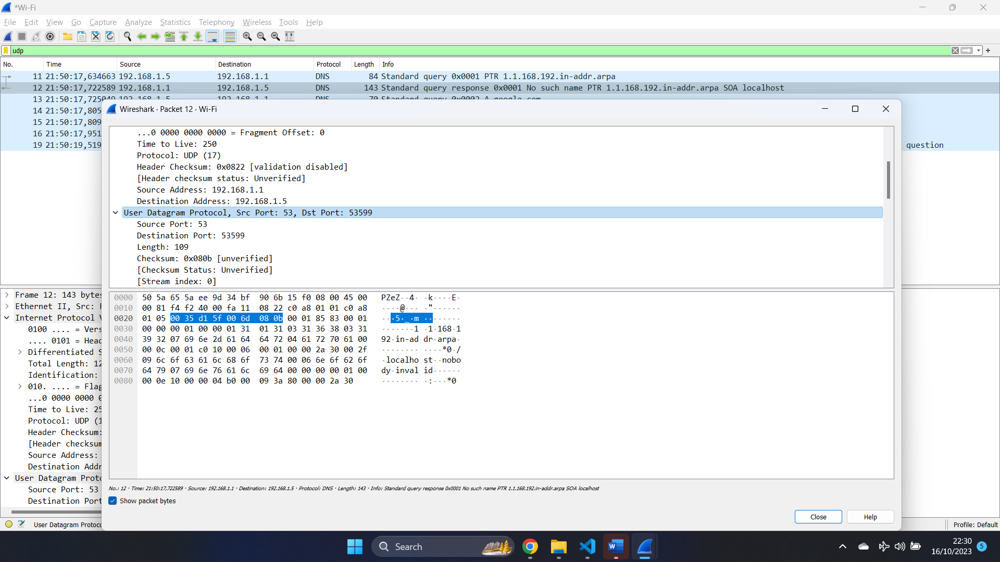

# Jarkom-Tugas-TCP-UDP

# TCP
## soal 1
What is the IP address and TCP port number used by the client computer (source)
that is transferring the alice.txt file to gaia.cs.umass.edu?

### jawaban
pada file capture filter http. pilih paket untuk mendapatkan detail paket. pada detail paket terdapat informasi IP Adress source dan Port source

didapat Ip source adalah: 192.168.86.68 dan port source adalah 55639

## Soal 2
What is the IP address of gaia.cs.umass.edu? On what port number is it sending
and receiving TCP segments for this connection?

### Jawaban
dari detail paket yang didapat dari nomor 1 juga terdapat informasi tentang ip dan port destination

didapat Ip destinatiom adalah: 128.119.245.12 dan port source adalah 80

## Soal 3
What is the sequence number of the TCP SYN segment that is used to initiate the TCP connection between the client computer and gaia.cs.umass.edu?

What is it in this TCP segment that identifies the segment as a SYN segment? 

Will the TCP receiver in this session be able to use Selectiven Acknowledgments (allowing TCP to function a bit more like a “selective repeat”
receiver, see section 3.4.5 in the text)?

### jawaban
filter TCP. kemudian cari paket yang merupakan [SYN]. setelah itu buka detail paket untuk mendapatkan sequence number nya

didapat sequence numbernya adalah 4236649187. 

yang mengidentifikasi bahwa segement ini merupakan SYN segment adalah Flagns-ya 0x002 (SYN)

ya, TCP receiver pada session ini dapat menggunakan Selectiven Acknowledgments

## Soal 4
What is the sequence number of the SYNACK segment sent by gaia.cs.umass.edu to the client computer in reply to the SYN? 

What is it in the segment that identifies the segment as a SYNACK segment? 

What is the value of the Acknowledgement field in the SYNACK segment? 

How did gaia.cs.umass.edu determine that value?

### jawaban

sequence numbernya adalah 1068969752

yang mengidentifikasi bahwa segement merupakan SYNACK adalah flag 0x012 (SYN, ACK)

Acknowledgement Valuenya adalah 4236649188

Dengan menambahkan 1 ke SYN segment sequence number sebelumnya yaitu, 4236649187

## Soal 5
What is the sequence number of the TCP segment containing the header of the HTTP POST command? 

How many bytes of data are contained in the payload (data) field of this TCP segment? 

Did all of the data in the transferred file alice.txt fit into this single segment?

### Pengerjaan
filter menggunakan tcp contains "POST"

didapat sequence number raw adalah 4236649188

didapat besar datanya adalah 1448 bytes

tidak, keseluruhan datanya tidak cukup dalam 1 segment

## Soal 6
Consider the TCP segment containing the HTTP “POST” as the first segment in the data transfer part of the TCP connection. 

* At what time was the first segment (the one containing the HTTP POST) in the data-transfer part of the TCP connection sent?
* At what time was the ACK for this first data-containing segment received?
* What is the RTT for this first data-containing segment?
* What is the RTT value the second data-carrying TCP segment and its ACK?
* What is the EstimatedRTT value (see Section 3.5.3, in the text) after the ACK for the second data-carrying segment is received? Assume that in making this calculation after the received of the ACK for the second segment, that the initial value of EstimatedRTT is equal to the measured RTT for the first segment, and then is computed using the EstimatedRTT equation on page 242, and a value of  = 0.125.

## Soal 7
What is the length (header plus payload) of each of the first four data-carrying
TCP segments?

## jawaban
32 bytes (ehader) + 1448 bytes (payload) = 1480 bytes (total)

## Soal 8
What is the minimum amount of available buffer space advertised to the client by gaia.cs.umass.edu among these first four data-carrying TCP segments7? 

Does the lack of receiver buffer space ever throttle the sender for these first four datacarrying segments?

## Soal 9
Are there any retransmitted segments in the trace file? 

What did you check for (in the trace) in order to answer this question?

## Soal 10
How much data does the receiver typically acknowledge in an ACK among the first ten data-carrying segments sent from the client to gaia.cs.umass.edu? 

Can you identify cases where the receiver is ACKing every other received segment (see Table 3.2 in the text) among these first ten data-carrying segments?

## Soal 11
What is the throughput (bytes transferred per unit time) for the TCP connection? Explain how you calculated this value.

## Soal 12
Use the Time-Sequence-Graph(Stevens) plotting tool to view the sequence number versus time plot of segments being sent from the client to the gaia.cs.umass.edu server. Consider the “fleets” of packets sent around t = 0.025, t = 0.053, t = 0.082 and t = 0.1. Comment on whether this looks as if TCP is in its slow start phase, congestion avoidance phase or some other phase. Figure 6 shows a slightly different view of this data.

## Soal 13
These “fleets” of segments appear to have some periodicity. What can you say about the period?

## Soal 14
Answer each of two questions above for the trace that you have gathered when you transferred a file from your computer to gaia.cs.umass.edu

# UDP
## Soal 1
Select the first UDP segment in your trace. What is the packet number of this segment in the trace file? 

What type of application-layer payload or protocol message is being carried in this UDP segment? 

Look at the details of this packet in Wireshark. How many fields there are in the UDP header? (You shouldn’t look in the textbook! Answer these questions directly from what you observe in the packet trace.) 

What are the names of these fields?

### Jawaban

paket pertama adalah paket no 11

aplication layer atau protocol message yang digunakan adalah DNS

ada 4 field source port, destination port, length, dan checksum

## Soal 2
By consulting the displayed information in Wireshark’s packet content field for this packet (or by consulting the textbook), what is the length (in bytes) of each of the UDP header fields?

### jawaban
karena ada 4 fields maka ada 8 bytes

## Soal 3
The value in the Length field is the length of what? (You can consult the text for this answer). Verify your claim with your captured UDP packet. 

### Jawaban
nilai dari length adalah nilai dari UDP header dan payload

## Soal 4
What is the maximum number of bytes that can be included in a UDP payload? (Hint: the answer to this question can be determined by your answer to 2. above)

### jawaban
karena tiap field hanya ada 2 bytes (16 bits). maka ada sekitar (2^16-1) = 65535 bits

## Soal 5
What is the largest possible source port number? (Hint: see the hint in 4.)

### jawaban
65535

## Soal 6
What is the protocol number for UDP?

### jawaban

17

## Soal 7
Examine the pair of UDP packets in which your host sends the first UDP packet and the second UDP packet is a reply to this first UDP packet

What is the packet number of the first of these two UDP segments in the trace file?

What is the packet number of the
second of these two UDP segments in the trace file?

Describe the relationship between the port numbers in the two packets. 

### jawaban

paket number pertama adalah 11

paket number kedua adalah 12

paket pertama memiliki src port number 53599 dan dst port number 53. paket kedua memiliki src port number 53 dan dst port number 53599. hubungan keduanya adalah dst port number paket 11 adalah src nport number paket 12 dan dst port number paket 12 adalah src port number paket 11

